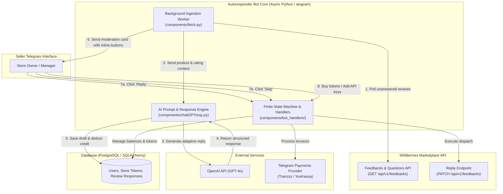
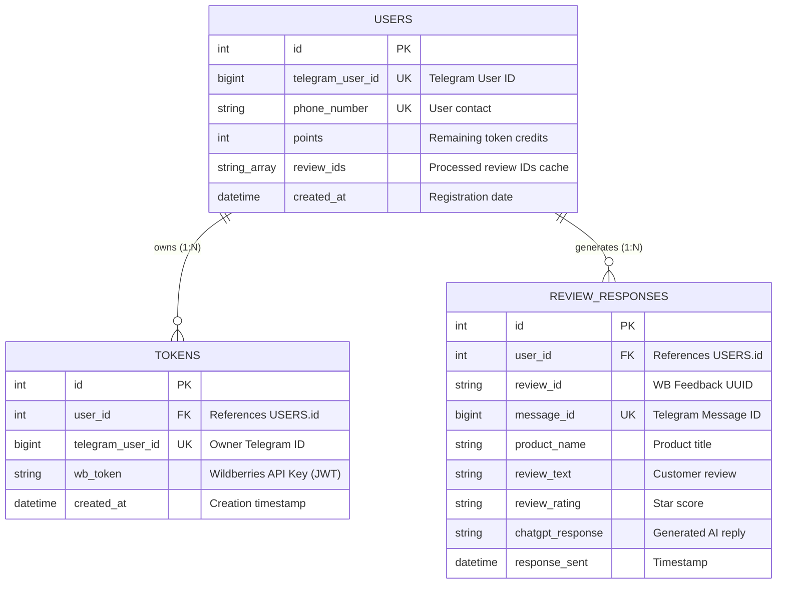

# Wildberries AI Review Autoresponder Bot

[](https://www.python.org/)
[](https://docs.aiogram.dev/)
[](https://openai.com/)
[](https://www.postgresql.org/)
[](https://www.sqlalchemy.org/)
[](https://opensource.org/licenses/MIT)

> **An automated, AI-driven review management system for Wildberries marketplace sellers.**  
> Streamlines customer relationship management by polling unanswered customer feedback, generating high-quality, tone-adapted responses using **OpenAI GPT-4o**, and enabling 1-click publishing directly via Telegram with an integrated credit & payment ledger.

---

## Executive Summary

In high-volume e-commerce marketplaces like **Wildberries**, rapid and thoughtful responses to customer reviews directly impact product rating, SEO ranking, and conversion rates. However, manually handling hundreds of reviews across multiple storefronts is time-consuming and expensive.

**Wildberries AI Autoresponder** solves this problem by automating the entire lifecycle:
1. **Detects** incoming unanswered buyer feedback in real time via official Wildberries REST APIs.
2. **Generates** polite, empathetic, brand-aligned responses tailored to positive praise or negative complaints using **GPT-4o**.
3. **Presents** human-in-the-loop moderation cards in Telegram with interactive action buttons (`💬 Reply`, `⏩ Skip`).
4. **Dispatches** approved responses back to the marketplace instantly via secure API endpoints.
5. **Monetizes** usage with a built-in token-based credit balance and integrated Telegram Payments.

---

## System Architecture & Workflow



---

## Key Features

- **Context-aware GPT-4o responses**:
  - Dynamically synthesizes personalized responses according to product title, seller brand name, star rating (1–5), and customer remarks.
  - Differentiates communication strategy: expresses gratitude for praise and offers polite empathy, resolution suggestions, and support for complaints.
- **Multi-account and multi-token store management**:
  - Store owners can bind multiple Wildberries seller tokens (1:N relationship) under a single Telegram account.
  - Token management interface with validation, view, and safe deletion.
- **Asynchronous worker**:
  - Background polling worker (`asyncio.create_task`) ingests unprocessed reviews asynchronously without blocking bot interactions.
  - In-memory and database deduplication preventing repeated processing of previously handled reviews.
- **Token and monetization system**:
  - Native integration with **Telegram In-App Payments API** (`send_invoice`, `pre_checkout_query`).
  - Credit package tiers with configurable pricing and automatic balance updates upon successful checkout.
- **Security and FSM guardrails**:
  - State machine (`FSMContext`) for secure onboarding of Wildberries API tokens with length and format validation.
  - Automatic deletion of messages containing raw API keys to protect sensitive credentials from chat history leaks.
  - User verification via native Telegram contact sharing.

---

## Tech Stack & Libraries

| Domain | Technology / Library | Purpose |
|---|---|---|
| **Language** | Python 3.10+ | Core runtime environment |
| **Bot Framework** | [`aiogram 2.25.2`](https://docs.aiogram.dev/) | Asynchronous Telegram Bot framework with FSM |
| **AI / LLM** | [`openai 1.41+`](https://github.com/openai/openai-python) | GPT-4o model integration for intelligent responses |
| **Database** | [PostgreSQL](https://www.postgresql.org/) + [`SQLAlchemy 2.0`](https://www.sqlalchemy.org/) | Relational schema, ORM data modeling, migrations |
| **DB Driver** | [`psycopg2-binary`](https://pypi.org/project/psycopg2-binary/) | High-performance PostgreSQL driver |
| **HTTP Client** | [`requests`](https://requests.readthedocs.io/), [`aiohttp`](https://docs.aiohttp.org/) | REST communication with Wildberries Seller API |
| **Payments** | Telegram Payments API (Tranzzo / YooKassa) | In-app credit top-ups and checkout invoices |
| **Config** | [`python-dotenv`](https://pypi.org/project/python-dotenv/) | Twelve-factor environment variable management |

---

## Database Schema

The database model is structured around a multi-tenant design using SQLAlchemy ORM:



---

## Repository Structure

```
wb_seller_reviews_autoresp/
├── components/
│   ├── bot.py                  # Bot initialization, global routing, error handling
│   ├── chatGPTresp.py          # OpenAI GPT-4o prompt engineering & API invocation
│   ├── config.py               # Application configuration, environment variables, FSM memory storage
│   ├── database.py             # SQLAlchemy models (User, Token, ReviewResponse) & DB session
│   ├── fetch.py                # Asynchronous worker polling Wildberries feedback API
│   ├── keyboards.py            # Inline and reply keyboard layouts & navigation
│   ├── bot_components/
│   │   └── options.py          # Pricing tiers, token packages, constant definitions
│   └── bot_handlers/
│       ├── buy_tokens_handler.py    # Telegram payments, invoices & pre-checkout queries
│       ├── contact_handler.py       # Contact sharing & user registration
│       ├── info_handlers.py         # FAQ, API guide, and bot manuals
│       ├── main_menu_handlers.py    # Main menu navigation, FSM API key addition, account settings
│       ├── respond_handlers.py      # Moderation buttons (Reply to WB, Skip feedback)
│       └── response_functions/
│           └── reply.py             # Wildberries REST API client (PATCH review response)
├── .env.example                # Template for environment configuration
├── .gitignore                  # Git ignore rules for environments and bytecode
├── docker-compose.yml          # Multi-container orchestration (Bot + PostgreSQL)
├── Dockerfile                  # Container definition for the Python bot service
├── main.py                     # Entry point (initiates polling via aiogram executor)
├── requirements.txt            # Pinned project dependencies
└── README.md                   # Project documentation
```

---

## Quick Start Guide

### Option A: Run with Docker Compose (Recommended)

1. **Clone the repository**:
   ```bash
   git clone https://github.com/artcevvv/wb_seller_reviews_autoresp.git
   cd wb_seller_reviews_autoresp
   ```

2. **Configure environment variables**:
   ```bash
   cp .env.example .env
   ```
   *Fill in `TELEGRAM_BOT_TOKEN`, `GPT_API_TOKEN`, and `TRANZZO_TEST_PAYMENT` in `.env`.*

3. **Launch containers**:
   ```bash
   docker compose up --build -d
   ```
   *This starts both the PostgreSQL database (with automated healthchecks and volume persistence) and the Telegram Bot container.*

4. **View logs**:
   ```bash
   docker compose logs -f bot
   ```

---

### Option B: Local Manual Setup

#### 1. Prerequisites
- **Python 3.10** or higher installed.
- **PostgreSQL** instance running locally or hosted on a cloud provider.
- Telegram Bot token obtained from [@BotFather](https://t.me/BotFather).
- OpenAI API Key with access to `gpt-4o`.
- Wildberries Seller account with access to the **Feedbacks & Questions API token**.

#### 2. Clone and Setup Environment

```bash
# Clone repository
git clone https://github.com/artcevvv/wb_seller_reviews_autoresp.git
cd wb_seller_reviews_autoresp

# Create virtual environment
python3 -m venv venv
source venv/bin/activate  # On Windows: venv\Scripts\activate

# Install dependencies
pip install -r requirements.txt
```

#### 3. Environment Configuration

Copy `.env.example` to `.env` and fill in your credentials:

```bash
cp .env.example .env
```

Edit `.env`:

```ini
# Telegram Bot
TELEGRAM_BOT_TOKEN=1234567890:ABCdefGHIjklMNOpqrsTUVwxyz

# OpenAI
GPT_API_TOKEN=sk-proj-xxxxxxxxxxxxxxxxxxxxxxxx

# Wildberries API Endpoint
WILDBERRIES_API_ENDPOINT=https://feedbacks-api.wildberries.ru/api/v1/feedbacks

# PostgreSQL Database
POSTGRES_SQL_HOST=localhost
POSTGRES_SQL_PORT=5432
POSTGRES_SQL_USER=postgres
POSTGRES_SQL_DBNAME=wb_bot_db
POSTGRES_SQL_PASS=your_secure_postgres_password

# Payments (Telegram Provider Token from @BotFather)
TRANZZO_TEST_PAYMENT=284685063:TEST:xxxxxxxxxx
```

#### 4. Database Initialization

Ensure your PostgreSQL database is created:

```sql
CREATE DATABASE wb_bot_db;
```

The tables (`users`, `tokens`, `review_responses`) will be automatically created on startup via `Base.metadata.create_all(bind=engine)` in [`components/database.py`](components/database.py).

#### 5. Run the Application

```bash
python main.py
```

---

## Prompt Engineering Highlight

The system leverages dynamic prompting tailored specifically for e-commerce reputation management. It instructs GPT-4o to act as a supportive, empathetic brand representative:

```python
messages = [
    {
        "role": "system",
        "content": "Ты продавец на wildberries, и тебе нужно отвечать на отзывы клиентов.",
    },
    {
        "role": "user",
        "content": (
            f"Ты — продавец магазина на Wildberries, и на твой товар оставлен отзыв. "
            f"Название магазина: {review_supplier}. Товар: {review_item}. Оценка: {review_rating}. "
            "Составь вежливый и профессиональный ответ на этот отзыв. В начале поблагодари клиента за отзыв. "
            "Если отзыв положительный, вырази благодарность и подчеркни положительные моменты. "
            "Если отзыв содержит жалобу или проблему, вырази сочувствие, покажи, что ты понимаешь "
            "озабоченность клиента, и предложи возможные решения или альтернативы. "
            "Обращайся к клиенту уважительно и поддерживающе, показывая готовность помочь и улучшить его опыт. "
            f'Отзыв клиента: "{review_text}". Если текст отзыва отсутствует, ориентируйся только на оценку.'
        ),
    },
]
```

---

## Roadmap & Engineering Enhancements

- [x] **Docker & Docker Compose**: Containerize PostgreSQL, Telegram Bot worker, and multi-container orchestration.
- [ ] **Migrate to aiogram 3.x**: Upgrade to the latest version with modern routers, filters, and async primitives.
- [ ] **Task Queue (Celery / ARQ + Redis)**: Decouple review fetching into distributed worker tasks with exponential backoff and rate-limiting.
- [ ] **Custom Store Persona & Tone Config**: Allow sellers to configure custom greeting styles, brand signatures, and promotion links.
- [ ] **Analytics Dashboard**: Add review sentiment analysis, average rating over time, and response time metrics.

---

## Author & Contact

Developed by **artcevvv**  
- **GitHub**: [github.com/artcevvv](https://github.com/artcevvv)  
- **Contact**: [artcevvv.com](https://artcevvv.com)
---

## License

This project is licensed under the MIT License — see the [LICENSE](LICENSE) file for details.
